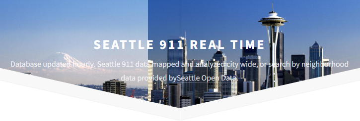
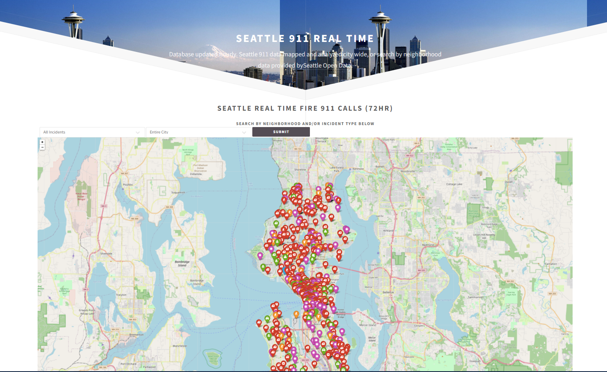
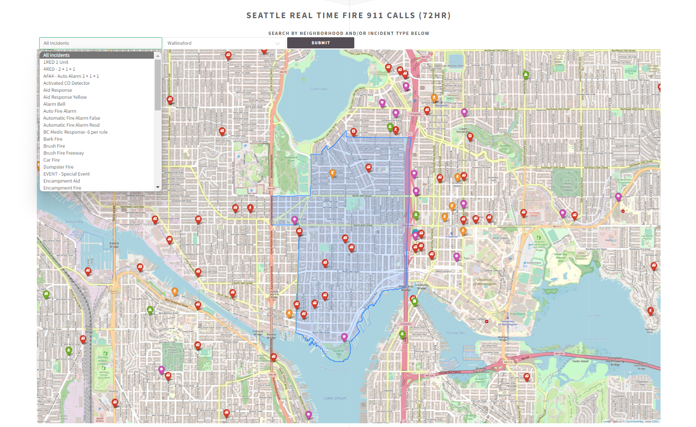
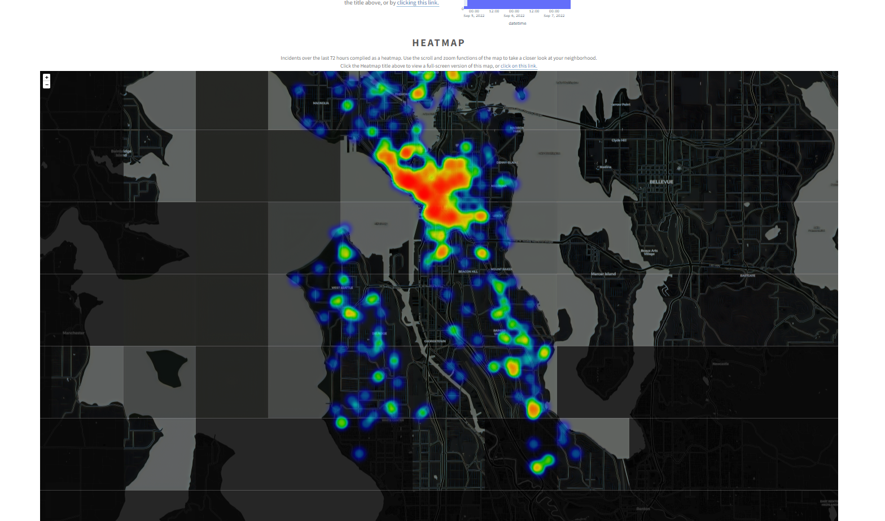
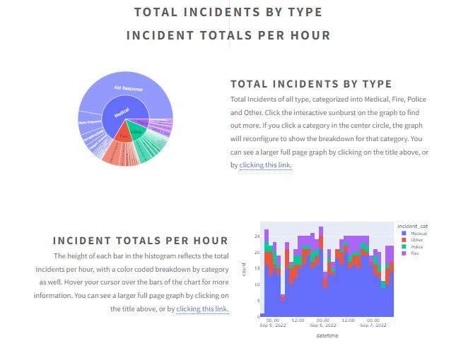

<!-- Improved compatibility of back to top link: See: https://github.com/othneildrew/Best-README-Template/pull/73 -->
<a name="readme-top"></a>

<!--
*** I'm using markdown "reference style" links for readability.
*** Reference links are enclosed in brackets [ ] instead of parentheses ( ).
*** See the bottom of this document for the declaration of the reference variables
*** for contributors-url, forks-url, etc. This is an optional, concise syntax you may use.
*** https://www.markdownguide.org/basic-syntax/#reference-style-links
-->


<!-- PROJECT LOGO -->
<br />
<div align="center">
  <a href="https://github.com/github_username/repo_name">
    
  </a>

<h3 align="center">Seattle 911</h3>

  <p align="center">
    <p>City of Seattle data maps, based on data provided by <a href="https://data.seattle.gov/">https://data.seattle.gov/</a> </p>
    <br />
    <a href="https://github.com/github_username/repo_name"><strong>Explore the docs »</strong></a>
    <br />
    <br />
    <a href="https://github.com/github_username/repo_name">View Demo</a>
    ·
    <a href="https://github.com/github_username/repo_name/issues">Report Bug</a>
    ·
    <a href="https://github.com/github_username/repo_name/issues">Request Feature</a>
  </p>
</div>


<!-- TABLE OF CONTENTS -->
<details>
  <summary>Table of Contents</summary>
  <ol>
    <li>
      <a href="#about-the-project">About The Project</a>
      <ul>
        <li><a href="#built-with">Built With</a></li>
      </ul>
    </li>
    <li>
      <a href="#getting-started">Getting Started</a>
      <ul>
        <li><a href="#prerequisites">Prerequisites</a></li>
        <li><a href="#installation">Installation</a></li>
      </ul>
    </li>
    <li><a href="#usage">Usage</a></li>
    <li><a href="#roadmap">Roadmap</a></li>
    <li><a href="#license">License</a></li>
    <li><a href="#contact">Contact</a></li>
  </ol>
</details>


<!-- ABOUT THE PROJECT -->
## About The Project
Seattle 911 generates maps of 911 emergency call data, based on data provided by https://data.seattle.gov/
Data is mapped for the previous 72 hours.

This has been superseded by my seattle data app, which draws upon the full range of data 
provided by the  https://data.seattle.gov/ api.

https://github.com/noele952/seattle-data-final

Written in Python on the Flask web framework, with maps generated with folium, and graphs generated with plotly
<div align="center">

</div>


<p align="right">(<a href="#readme-top">back to top</a>)</p>


### Built With

* ## <a href="https://flask.palletsprojects.com/en/2.2.x/">Flask</a>
* ## <a href="https://python-visualization.github.io/folium/">Folium</a>
* ## <a href="https://plot.ly/export/">Plotly</a>
Data provided by: https://data.seattle.gov/

<p align="right">(<a href="#readme-top">back to top</a>)</p>


<!-- GETTING STARTED -->
## Getting Started

If you would like to run it locally, a Docker container is available.
* docker
  ```sh
  docker pull noele952/seattle911
  ```
  ```sh
  docker run noele952/seattle911
  ```  
   

<p align="right">(<a href="#readme-top">back to top</a>)</p>


<!-- USAGE EXAMPLES -->
## Usage
<div align="center">

<p>On the landing page will be displayed a map showing incident data posted within
the last 72 hours. With the search bar at the top of the map you can search by neighborhood,
incident type, or both</p>

<p>Below that is the same data in the form of a heatmap</p>

<p>At the bottom you will find the databroken down into categories, reprsented 
in a histogram, and an interactive sunburst graph</p>


</div>

<p align="right">(<a href="#readme-top">back to top</a>)</p>


<!-- LICENSE -->
## License

Distributed under the MIT License. See `LICENSE.txt` for more information.

<p align="right">(<a href="#readme-top">back to top</a>)</p>


<!-- CONTACT -->
## Contact

Noel Alderman - [@vintageeurocars](https://twitter.com/twitter_handle) - noele952@gmail.com

Project Link: [https://github.com/noele952/seattle911](https://github.com/github_username/repo_name)

<p align="right">(<a href="#readme-top">back to top</a>)</p>


<!-- MARKDOWN LINKS & IMAGES -->
<!-- https://www.markdownguide.org/basic-syntax/#reference-style-links -->


